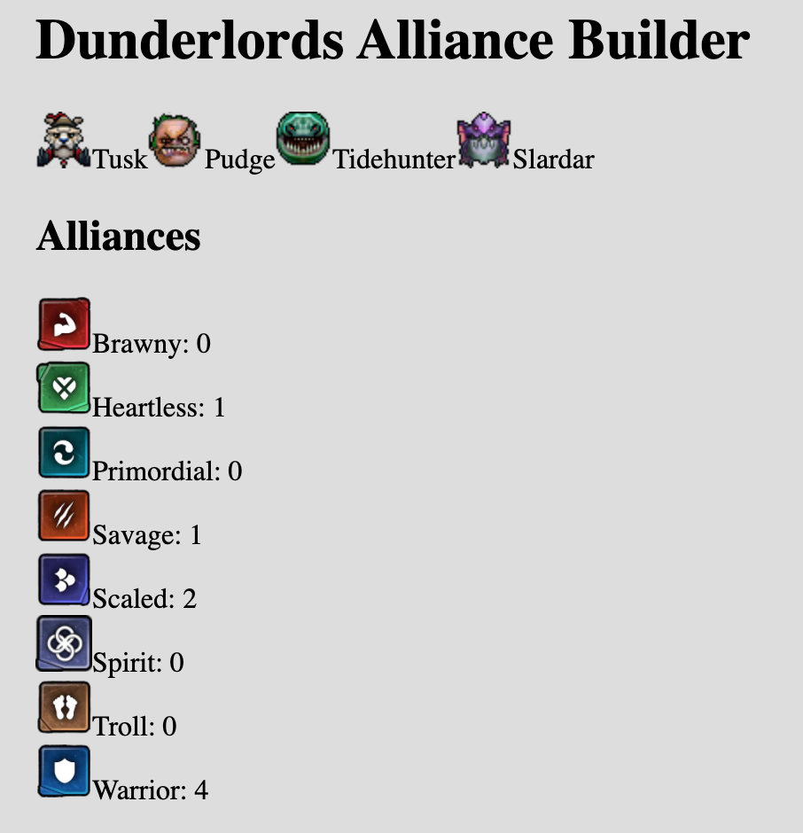

# Dunderlords Alliance Builder

Mix and match builds, see suggestions for alterations, more?



## Developing

Elm dev environment with hot-loading. Committing to FULL NPM. No more yarn for now. I don't think it matters much, but the ambiguity hurts.

```sh
npm test
npm start # localhost:3000
# Share with friends!
ngrok http 3000 -host-header="localhost:3000"
```

## Production

Build production assets (js and css together) with:

```sh
npm run prod
```

## Elm-analyse

Add pre-commit hook (@rj halp)

```sh
$ npm run analyse
```

 ## Credits

 Originally forked from https://github.com/simonh1000/elm-webpack-starter
